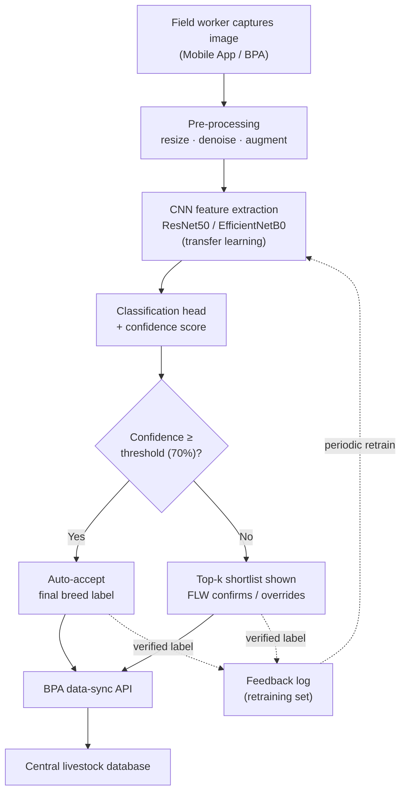
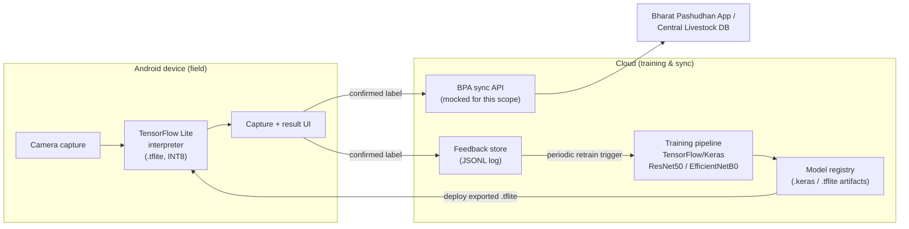

# BharatBreed AI
### AI-Powered Image-Based Breed Recognition System for Indian Cattle & Buffaloes

Minor Project — Department of Information Technology, Bhagwan Parshuram Institute of Technology, Rohini, New Delhi
Guide: Dr. Varsha Sharma | Team: Arsh Tiwari (15520802723), Mayank (15220802723), Harshit Aggarwal (15020802723)
Modelled on Smart India Hackathon problem statement **SIH25004** — *"Image based breed recognition for cattle and buffaloes of India"* (Ministry of Fisheries, Animal Husbandry & Dairying).

---

## 1. The problem, in one paragraph

Field Level Workers (FLWs) enter livestock records into the **Bharat Pashudhan App (BPA)**, India's national livestock database. Every other field in that record is fairly objective — but **breed is typed in by a human, from memory, by eye**. India has 50+ recognised cattle breeds and a dozen+ buffalo breeds, many visually close and further blurred by cross-breeding. That single manual field quietly corrupts a database used for genetic-improvement schemes, vaccination drives, insurance claims and subsidy disbursal. Academic work on cattle breed classification exists, but it almost always stops at "we trained a model and got X% accuracy" on a small curated dataset — it doesn't address running on a ₹8,000 Android phone with patchy connectivity, or how the prediction gets back into BPA. **BharatBreed AI closes that specific, second half of the gap.**

---

## 2. Proposed solution — in points

1. **Confidence-aware CNN, not a forced single answer.** A transfer-learning model (EfficientNetB0 / ResNet50 backbone) predicts a breed. If it's confident (≥70%), auto-accept. If not, show the FLW a ranked top-3 shortlist instead of guessing on their behalf.
2. **Mobile-first from day one.** The trained model is exported to **TensorFlow Lite** (float32 + INT8 quantized) so inference runs on-device on low/mid-range Android hardware, without needing connectivity at the point of capture.
3. **A human stays in the loop exactly where the model is weakest.** Low-confidence predictions are never silently written to the database — they're routed to the FLW for confirmation or manual override.
4. **The system plugs into BPA, not around it.** A defined sync API pushes confirmed breed labels into BPA's data layer, so the fix reaches the record it's meant to correct (mocked for this minor-project's scope, per the synopsis).
5. **The model gets better the more it's used.** Every confirmation, correction, or override is logged. That log becomes the retraining set for the next model version — the feedback loop most published academic work skips entirely.
6. **Built for India-specific breeds and field conditions**, not generic/Western dairy-breed datasets photographed in studios — trained with augmentation (blur, brightness jitter, crops) that simulates real rural photography.

---

## 3. System architecture



**Reading the diagram:** everything left of the diamond is the "AI" half of the project (perception); everything right of it, including the feedback arrow back into the CNN box, is the "system" half that most academic prototypes never build. That second half is this project's actual contribution.

## 4. Technical / deployment architecture



**Why this shape:** training happens once, offline, on a machine with a GPU (or Colab); the *only* thing that ships to the field is a small `.tflite` file plus a plain UI. Nothing in the field path depends on connectivity except the final sync step, which can queue and retry.

---

## 5. Tech stack, and why

| Layer | Choice | Why this and not something else |
|---|---|---|
| Model framework | **TensorFlow / Keras** | First-class, well-documented path from a trained Keras model straight to `.tflite` — the mobile-deployment story is the reason the whole project exists, so we picked the framework with the shortest, most reliable path to that artifact. |
| Backbone | **EfficientNetB0** (ResNet50 supported as a swappable alternative) | Best accuracy-per-parameter for a small, India-specific dataset trained with transfer learning; EfficientNetB0 is ~5M params vs. ResNet50's ~25M, which matters directly for on-device latency and `.tflite` size. |
| Transfer learning | Two-stage: frozen backbone → head training → partial unfreeze → low-LR fine-tune | Standard practice for small datasets: prevents catastrophic forgetting of ImageNet features while still adapting the top layers to breed-specific texture/shape cues. |
| Mobile inference | **TensorFlow Lite** (float32 + dynamic-range INT8 quantized) | This *is* the deployment target described in the synopsis. Quantization gives a ~3–4x size reduction with a small accuracy trade-off, which matters on low-end Android hardware and metered rural data. |
| Data pipeline | **tf.data** with on-the-fly augmentation (flip, brightness/contrast jitter, random crop) | Keeps augmentation in the training graph (fast, no separate preprocessing step) and directly encodes the "variable field conditions" requirement from the synopsis. |
| Image ops | **Pillow / OpenCV / NumPy** | Standard, dependency-light tooling for the pre-processing stage (resize, denoise, dataset generation). |
| Confidence-decision logic | Plain Python (`inference.py`) | This is a business-logic layer, not a modelling problem — keeping it framework-agnostic means it can sit in front of *any* future model without rewrites. |
| Feedback / retraining log | Append-only **JSONL** file | Deliberately the simplest possible durable log for a minor project. Same shape a real system would write to Kafka/a database table — swapping the sink later doesn't change the calling code. |
| BPA integration | **Mocked REST-shaped stub** (`bpa_sync_stub.py`) | The synopsis explicitly scopes this as *"simulated/mocked... where direct government access is not available"* (section 4.3). The stub defines the exact request/response contract so a real integration is a drop-in replacement, not a redesign. |
| Testing | **pytest**-style sanity tests | Catches the two failure modes that actually break demos: a stale label map, and a `.tflite` model that doesn't load — both are checked before you ever stand up in front of a mentor. |

Explicitly **not built**: a production website / hosted backend. Per project scope, this is a model + pipeline + CLI-level system, not a deployed web product — the "interface" objective in the synopsis is satisfied by the command-line demo (`run_pipeline.py`) and the confidence-aware `inference.py` output, which is exactly what a mobile app's UI layer would call into.

---

## 6. Project structure

```
BharatBreedAI/
├── README.md
├── requirements.txt
├── run_pipeline.py              # one command: runs the entire pipeline end-to-end
├── data/
│   ├── raw/<breed_name>/*.jpg   # training images, one folder per class
│   └── processed/               # reserved for cached/derived data
├── models/
│   ├── bharatbreed_model.keras
│   ├── bharatbreed_model.tflite
│   ├── bharatbreed_model_int8.tflite
│   └── label_map.json
├── logs/
│   ├── training_history.json
│   ├── feedback_log.jsonl
│   └── bpa_sync_mock.jsonl
├── src/
│   ├── config.py                 # all paths + hyperparameters in one place
│   ├── generate_sample_dataset.py# synthetic placeholder dataset (offline demo only)
│   ├── data_prep.py              # tf.data pipeline + augmentation + split
│   ├── model.py                  # transfer-learning model builder
│   ├── train.py                  # two-stage training entry point
│   ├── convert_tflite.py         # exports + benchmarks .tflite artifacts
│   ├── inference.py               # confidence-aware prediction (the decision layer)
│   ├── feedback_loop.py           # logs field confirmations/overrides
│   └── bpa_sync_stub.py           # mocked BPA data-sync API
└── tests/
    └── test_pipeline.py           # end-to-end sanity checks
```

---

## 7. How to run it

### 7.1 Setup

```bash
git clone <your-repo-url> BharatBreedAI
cd BharatBreedAI
python3 -m venv .venv && source .venv/bin/activate      # optional but recommended
pip install -r requirements.txt
```

### 7.2 One command, full pipeline (recommended for a demo)

```bash
python run_pipeline.py
```

This will, in order: generate a small placeholder dataset (only if `data/raw/` is empty), train the model, export it to TFLite, run a confidence-aware prediction on a sample image, log a simulated field confirmation, and sync it to the mocked BPA endpoint. Everything needed for a live walkthrough happens in this one command.

### 7.3 Step-by-step (if you want to inspect / present each stage)

```bash
python src/generate_sample_dataset.py   # 1. build the demo dataset
python src/train.py                     # 2. transfer-learning training (2-stage)
python src/convert_tflite.py            # 3. export + benchmark TFLite models
python src/inference.py data/raw/Gir/Gir_000.jpg   # 4. single-image prediction
python src/feedback_loop.py             # 5. demo feedback logging
python src/bpa_sync_stub.py             # 6. demo mocked BPA sync
```

### 7.4 Using real breed photographs instead of the placeholder set

Replace the contents of `data/raw/<breed_name>/` with real images (e.g. a public Indian cattle/buffalo breed dataset, or field-collected photos), keeping one folder per breed. Nothing else changes — `data_prep.py` reads whatever class folders it finds. With real data and internet access (so `weights="imagenet"` downloads successfully in `model.py`), accuracy will be dramatically higher than the placeholder run described below.

### 7.5 Run the sanity tests

```bash
python -m pytest tests/ -v
# or: python tests/test_pipeline.py
```

### 7.6 A note on this repo's demo run

This repository ships with a **synthetic placeholder dataset** (procedurally generated shapes/colours standing in for breeds) so the *entire* pipeline — training, TFLite export, confidence-based inference, feedback logging, mocked BPA sync — can be verified end-to-end with zero setup, no internet dependency, and no copyrighted image dataset bundled into the repo. Because of that, and because in a fully offline environment the ImageNet pretrained weights can't be downloaded either (the code detects this and falls back to random init automatically — see `model.py`), **the demo run's reported accuracy is not representative of real-world performance.** Swap in a real, labelled breed dataset and run with internet access, and the exact same code trains a genuine transfer-learning classifier — this is a data/weights substitution, not a code change.

---

## 8. Scalability notes

- **Model size / latency:** EfficientNetB0 + INT8 quantization keeps the deployed artifact in the low single-digit MB range with millisecond-scale inference — this was a design constraint, not an afterthought, because the target device is a field worker's existing mid-range phone.
- **Horizontal scale on the backend:** training and any hosted inference service are stateless and containerizable; `EPOCHS_HEAD` / `EPOCHS_FINE_TUNE` / `BATCH_SIZE` in `config.py` are the knobs to turn for a full-size dataset on a GPU box or Colab, no code changes needed.
- **Growing the breed list:** adding a new breed is "add a folder of images to `data/raw/` and retrain" — the label map is generated automatically from the folder names, nothing is hardcoded.
- **The feedback loop is the real scaling lever.** As more FLWs use the system, `logs/feedback_log.jsonl` grows into a genuinely India-specific, field-condition labelled dataset that a lab-curated academic dataset can never match — accuracy should improve *with* adoption, not despite it.
- **Sync is designed to be offline-tolerant:** predictions and confirmations are logged locally first; the BPA sync step is a separate call that can be retried/queued, so a dead connection at the point of capture doesn't block the FLW.

---

## 9. Existing work — what's out there, and why this is different

| Source | What it does | Gap vs. this project |
|---|---|---|
| [Kaggle "Indian Bovine Breeds" + a public PyTorch pipeline](https://github.com/ramkamal452/SIH25004) | Downloads the Kaggle dataset, trains a classifier, reports accuracy on a test split. | Stops at a trained model; no confidence-aware decision layer, no mobile export, no integration path into BPA, no feedback loop. |
| Published Indian-breed image classification studies (ICAR e-Publications, IJRASET) — cited in this project's own bibliography | Demonstrate CNNs can distinguish Indian cattle/buffalo breeds from images with reasonable accuracy on curated datasets. | Evaluated on accuracy alone, on small controlled-condition datasets; deployability (mobile latency, field-image robustness, government-system integration) isn't in scope. |
| Buffalo-breed CNN studies, e.g. Neli-Ravi vs Khundi self-activated CNN research ([MDPI, 2022](https://www.mdpi.com/2077-0472/12/9/1386)) | Strong accuracy (~93%) on a narrow 2–3 class buffalo-breed problem. | Narrow scope (2–3 breeds, not India's 50+ cattle breeds + a dozen buffalo breeds); no deployment or database-integration story. |
| General livestock computer-vision surveys (e.g. cow re-identification, behaviour recognition — [ScienceDirect](https://www.sciencedirect.com/science/article/abs/pii/S0168169919321490)) | Cover adjacent problems: individual animal ID, behaviour, health monitoring. | Different problem (identity/behaviour, not breed), and again largely benchmark-accuracy-focused rather than field-deployment-focused. |
| **SIH25004 itself** (government problem statement) | Explicitly calls for breed recognition that improves BPA data quality. | This project is a direct, scoped implementation attempt at exactly that brief — most hackathon/academic submissions solve the classifier half and leave the "how does this actually reach BPA" half as future work. We built that half too, even if mocked for now. |

**In one line:** almost everyone who has touched this problem stops at "here's a model and its accuracy." This project's contribution is everything *around* the model — the confidence-aware decision layer, the mobile export path, the mocked-but-real integration contract with BPA, and the feedback loop — because that surrounding system is what the synopsis's problem statement (and SIH25004) actually asks for.

---

## 10. Outcomes delivered

- A trained, transfer-learning CNN breed classifier (swappable ResNet50 / EfficientNetB0 backbone).
- `.tflite` (float32) and quantized `.tflite` (INT8) exports, benchmarked for inference latency.
- A confidence-aware inference layer that auto-accepts high-confidence predictions and defers to a human for the rest.
- A feedback-logging mechanism that captures every field confirmation/override for future retraining.
- A mocked-but-fully-specified BPA data-sync integration.
- An end-to-end runnable pipeline (`run_pipeline.py`) and a passing sanity-test suite (`tests/`).

---

## 11. Bibliography

1. ICAR e-Publications, "Image-based breed identification and classification studies on Indian livestock," *International Journal of Dairy Science* — https://epubs.icar.org.in/index.php/IJDS/article/view/163317
2. IJRASET, "Image-Based Breed Recognition of Indian Cattle and Buffaloes" — https://www.ijraset.com/research-paper/image-based-breed-recognition-of-indian-cattle-and-buffaloes
3. ScienceDirect, "Computer vision-based approaches to livestock/cattle recognition," *Computers and Electronics in Agriculture* — https://www.sciencedirect.com/science/article/abs/pii/S0168169919321490
4. K. He, X. Zhang, S. Ren, J. Sun, "Deep Residual Learning for Image Recognition (ResNet)," CVPR 2016.
5. Bharat Pashudhan App (BPA), Department of Animal Husbandry & Dairying — https://www.pib.gov.in/PressReleaseDetail.aspx?PRID=2204580&reg=6&lang=1
6. M. Tan, Q. V. Le, "EfficientNet: Rethinking Model Scaling for Convolutional Neural Networks," ICML 2019.
7. United Nations, "Sustainable Development Goals — India" — https://india.un.org
8. TensorFlow Lite Documentation, Google — https://www.tensorflow.org/lite
9. Smart India Hackathon, SIH25004 problem statement — Ministry of Fisheries, Animal Husbandry & Dairying, https://www.sih.gov.in
